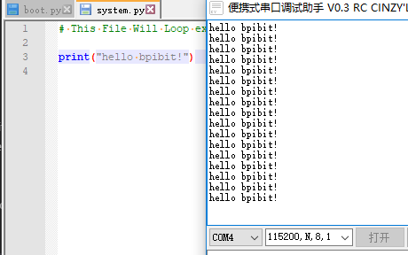

# **BpiBit MicroPython**

## **开发指南**

### 1. 编程环境介绍

&emsp;&emsp;由宇宙第一帅气的我来为大家介绍一下 Bpibit 的 Python 运行环境。

#### 标准编程环境

&emsp;&emsp;第一次使用固件的时候， BpiBit 系统会默认生成两个文件，分别为 boot.py 与 system.py 。 boot.py 仅在上电前运行一次，而 system.py 将会反复循环运行。

&emsp;&emsp;system.py 文件默认内容为 
```python 
# This file is executed on every boot (including wake-boot from deepsleep)
#import esp
#esp.osdebug(None)
#import webrepl
#webrepl.start()
```
&emsp;&emsp;而 boot.py 会有一行注释 
``` python
# This file is executed on every boot (including wake-boot from deepsleep)
```
&emsp;&emsp;意思就是该文件会在上电时执行一次。

#### 如何为 BpiBit 编写 Python 程序运行？

&emsp;&emsp;比如说在 system.py 写入如下代码：

```python
print("hello bpibit!")
```

&emsp;&emsp;则串口将会反复输出以下信息。

- 

&emsp;&emsp;这就是运行Python的第一步，我们已经成功了一大半。

#### 更好用的编程环境

&emsp;&emsp;虽然前面已经可以编写Python并执行了，但这样并不是我真正想要的。

&emsp;&emsp;因此可将Python环境分为开发环境和生产环境。

- #### 生产环境

&emsp;&emsp;在生产环境下，自己编写的Py代码不会被系统的其他服务打断，也就是在标准编程环境中将 system.py 写死循环即可，同时WebDav服务将不会被执行，也就无法在Python运行时修改Python代码了，这在要求执行时序稳定的情况下十分有用。

- #### 开发环境

&emsp;&emsp;在开发环境下，当然是希望编写代码保存后即刻生效，最好还可以控制程序的时序和随时停止或运行，所以在目录下的[CodeReloadToExectue](CodeReloadToExectue)分别提供了为boot.py、system.py、index.py文件，将其覆盖至固件当中，只需编写index.py代码文件即可，更多信息可以参阅目录下的ReadMe.md。

#### 相关案例与学习资料

&emsp;&emsp;以下相关教程与资源可以帮助你在Bpibit上了解和学习Python。

1. 官方文档资料

   1. [MicroPython Use Online](http://www.micropython.org/unicorn)
   2. [MicroPython Documents](http://docs.micropython.org/en/latest/esp8266/)
   3. [StudyPython ZeroBased](http://www.runoob.com/python/python-intro.html)
   4. [Esp32 中文开发文档](https://docs.singtown.com/micropython/zh/latest/esp32/index.html)

2. 硬件相关应用

   - 产品硬件测试流程代码
   - 播放音乐和变化呼吸灯代码
   - 如何使得两灯交错闪缩
   - 如何使用超声波测距
   - 如何获取外界温度
   - 如何控制开关当生物靠近时

3. 软件相关应用

   - 如何用Python验算加密算法
   - 如何用Python爬取网络数据
   - 如何用Python自动登陆网站
   