# **BpiBit MicroPython**

## **各类工具使用方法**

[TOC]

### 1. 获取 BitBpi 串口输出信息

&emsp;&emsp;在这之前请将 BpiBit 板子接入电脑，并确认存在串口驱动。

#### Windows
&emsp;&emsp;连接成功如图，在设备管理器中可以看到此时串口驱动正常且为COM3，所以我们只需要用相关的串口调试助手获取数据即可。

- &emsp;&emsp;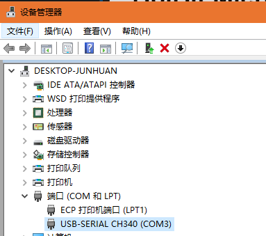

&emsp;&emsp;现在打开本目录下提供的工具 WinComDebug.zip ，打开压缩包后直接双击打开 COMdbg.exe ，将出现如下界面，如果出现打不开的情况请更换其他类似串口调试助手。

- &emsp;&emsp;

&emsp;&emsp;点击 COM3 的下拉列表的检测会获得其他串口，确保和看到的串口一致即可，接着点击打开后，就会如下图出现数据，前面存在一段乱码是不影响的，主要是看后面输出的信息，如下图所示。

- &emsp;&emsp;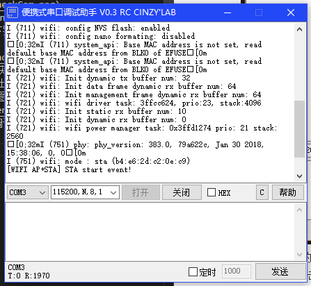

&emsp;&emsp;这样，你就学会了如何使用串口调试助手了，是不是很简单？

#### Linux

&emsp;&emsp;会使用Linux的同学应该不需要我教了吧。我附上一些图示就好了，我推荐安装 [minicom](http://linux.softpedia.com/get/Communications/Telephony/minicom-753.shtml) 串口工具后到 [minicom 配置](https://www.cnblogs.com/wonux/p/5897127.html) 即可。

&emsp;&emsp;打开的命令默认为 ` sudo minicom -D /dev/ttyUSB0 `，开启后效果如下图。

- &emsp;&emsp;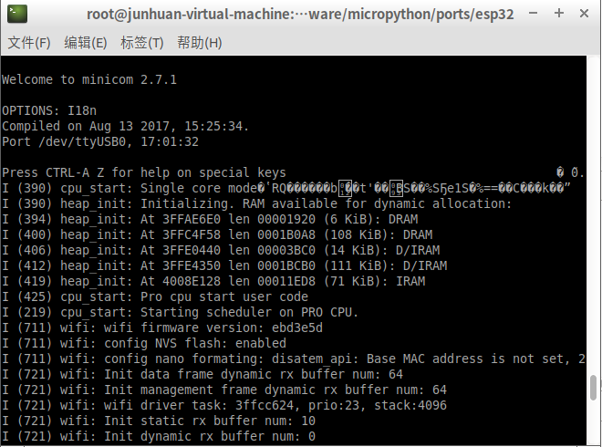

#### Mac

&emsp;&emsp;抱歉，这......大概是和上面的差不多的。（待购买）

### 2. 辅助 BitBpi 连接附近WIFI

&emsp;&emsp;先进入该模式[SmartConfig（A键）](https://github.com/junhuanchen/BPI-BIT-MpyDevelop#smartconfiga%E9%94%AE)后等待配网。

#### Android

&emsp;&emsp;当我们第一次使用 BpiBit 板子或想更换板子连接的 WIFI 的时候，会在串口调试助手里看到如下图的内容，有关于 SmartConfig 配置的功能，其中 smartconfig: SC_STATUS_FINDING_CHANNEL 表示 SmartConfig 正在等待配网。

- &emsp;&emsp;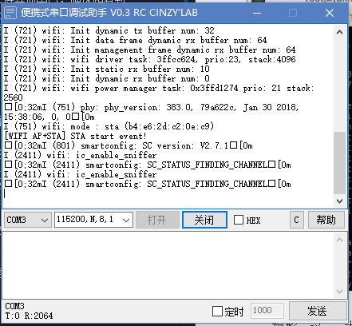

&emsp;&emsp;这时候我们可以从口袋里掏出手机，点上一曲普通的Disco，不是，emmm.....你应该可以下载安装并打开我提供的 Android 软件（SmartConfig.apk Or EspTouch.apk），没有安卓机？抱歉，这个，要不你从我这里拿一台去吧，用完快递回来给我就可以了。

&emsp;&emsp;用我酷炫的Redmi NOTE4X打开 SmartConfig.apk 软件的截图如下，可以看到，我现在所在的 WIFI 名称，接着我要填入 WiFI 的密码。

- &emsp;&emsp;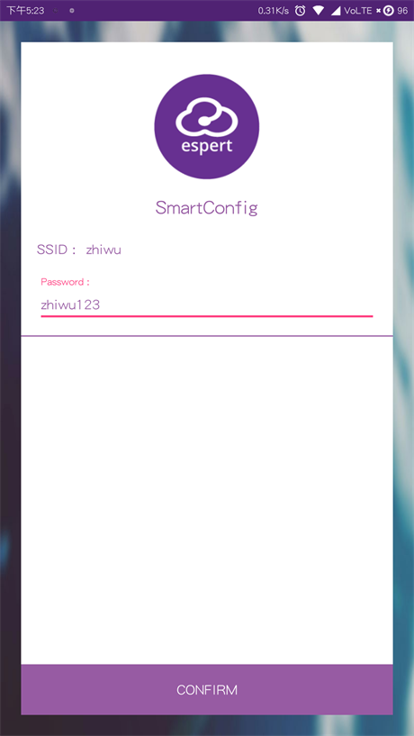

&emsp;&emsp;确定没问题了就点上唯一可以点的按钮（CONFIRM），手机的软件将会出现如下等待画面。

- &emsp;&emsp;

&emsp;&emsp;接着串口会输出如下信息。

- &emsp;&emsp;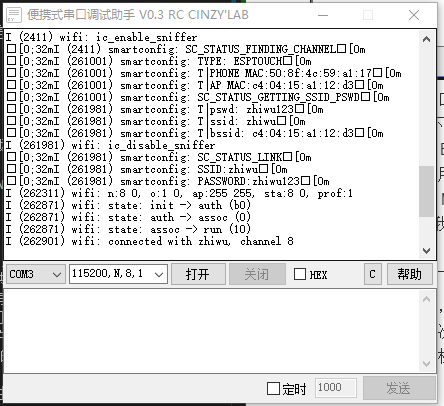

&emsp;&emsp;成功连接的情况下，串口输出如下图所示的信息`[WIFI AP+STA] ESP32 IP: XXX.XXX.XXX.XXX !`。

- &emsp;&emsp;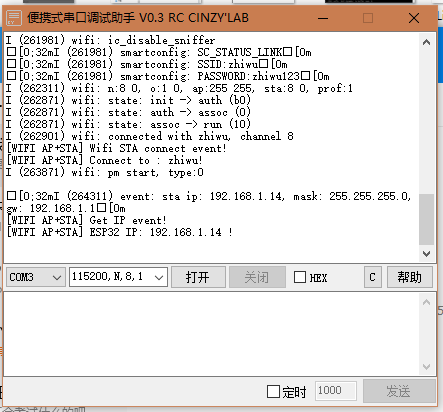

&emsp;&emsp;而手机软件也会告诉你板子现在的 IP 地址。

- &emsp;&emsp;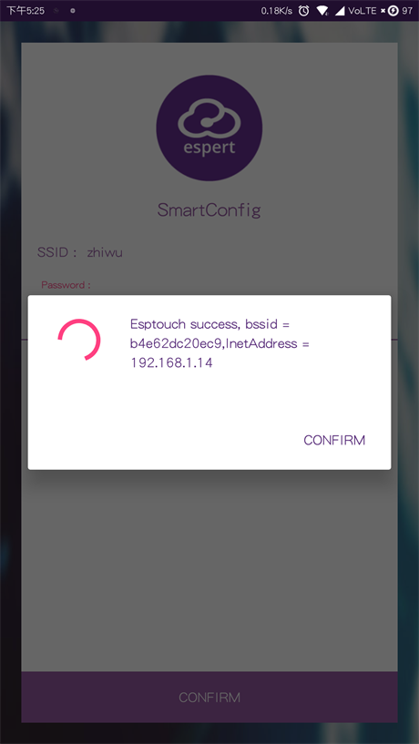

&emsp;&emsp;现在你就知道了板子的IP了，然后开始访问它吧。

&emsp;&emsp;提示：你也可以通过 `http://bit.local` 的地址来达到和 IP 访问一样的结果，它需要路由支持 mDns 功能，结合你的板子的名称即可快速访问到你的板子。

&emsp;&emsp;注意：如果你是第一次使用的话，它会格式化区域并重启一次以进入系统（会输出许多信息可以忽略），最终成功连接了结果如图。（如果没有出现，请换个 WIFI 试试，因为有些 WIFI 会拒绝从而导致持续出现 `[WIFI AP+STA] Wifi STA disconnect event, reconnect!`，出现这样的情况，建议重启板子或重新配网再次尝试，最后才考虑是 WIFI 热点的问题。

#### IOS

&emsp;&emsp;等我有钱了再说吧。

### 3. 访问 BitBpi 编辑文件教程

&emsp;&emsp;如果已经得知板子的IP，例如就在刚才我已经得到 IP: 192.168.1.14 了，就可以尝试访问板子的内部空间了。

&emsp;&emsp;提示：目前板子会在上电的时候输出4个十六进制数值，比如：92C2 ，这个可以可以用来代替 IP 访问板子空间，或与他人区分板子，此时访问的地址可以是域名 `http://bit92c2.local`，从而取代 IP 地址进行访问WebDAV，方便更换的连接WIFI-AP的时候不需要再新建客户端链接配置，同时也可以和其他小伙伴一起使用不受影响。

#### Windows

&emsp;&emsp;以 WebDrive 为例，打开软件界面如下。

- &emsp;&emsp;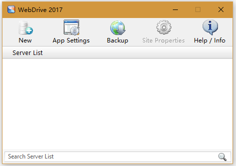

&emsp;&emsp;点击 New 新建一个连接，如下图，选择 WebDAV HTTP。

- &emsp;&emsp;

&emsp;&emsp;输入板子的IP，点击下一步，直到完成并保存。

- &emsp;&emsp;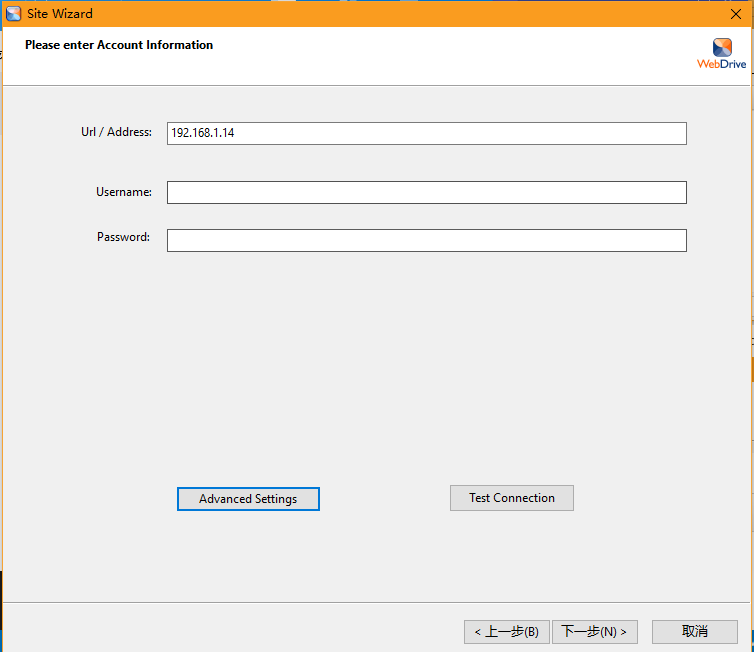

&emsp;&emsp;接着会回到主界面。

- &emsp;&emsp;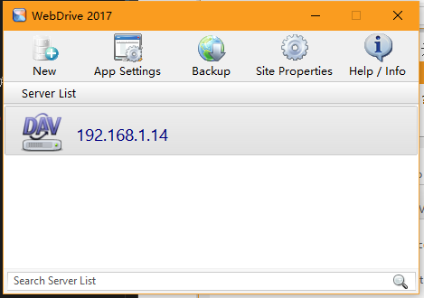

&emsp;&emsp;鼠标双击出现的IP地址，等待连接成功后会直接弹出文件夹。

- &emsp;&emsp;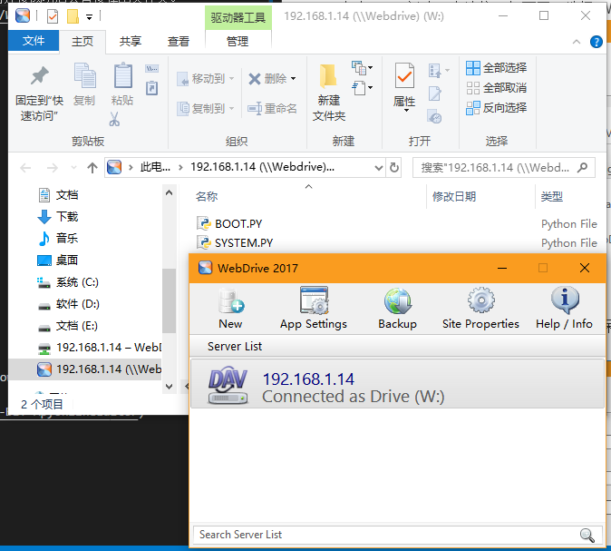

&emsp;&emsp;然后你就可以开始编程啦。

&emsp;&emsp;以 Mountain Duck （不推荐，并不好用，毕竟免费）为例，打开软件界面如下。

- &emsp;&emsp;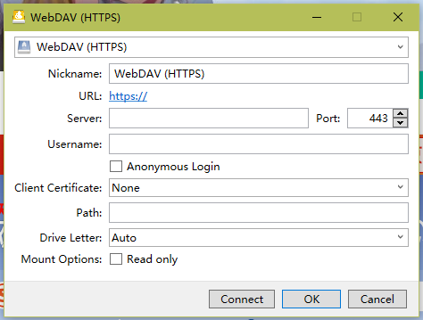

&emsp;&emsp;由于我们板子的 WebDAV 是使用HTTP协议且允许匿名进行访问，也就是无用户认证，所以需要修改如下图。

- &emsp;&emsp;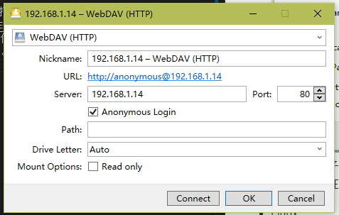

&emsp;&emsp;选择 WebDAV(HTTP) 项后填入我们板子的IP，其中的 Anonymous 指匿名，可有可无不影响，可以按下 Connect 尝试连接，成功了会弹出文件夹，如果不成功就会弹出 Try Again ，重试它直到成功即可。（如果你还没开始编程的情况下）

- &emsp;&emsp;

&emsp;&emsp;然后你又可以开始编程啦。

#### Android

&emsp;&emsp;以 WebDrive 为例，打开软件界面后点击右上角第二个菜单按键，出现界面如下。

- &emsp;&emsp;

&emsp;&emsp;新建一个连接，点击 Add Site，如下图，选择 WebDAV 。

- &emsp;&emsp;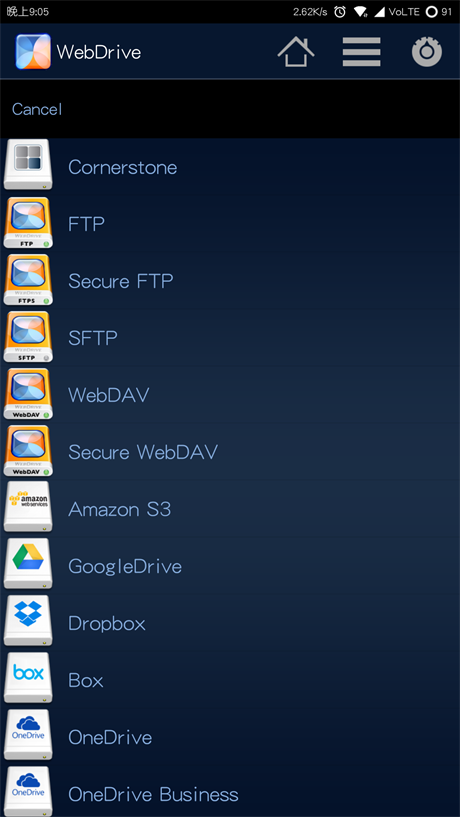

&emsp;&emsp;输入自定义的名称，和板子的IP与任意用户密码（比如 1 和 1），点击 Save 保存。

- &emsp;&emsp;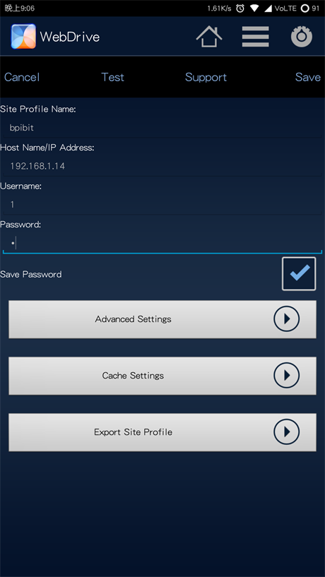

&emsp;&emsp;接着会回到主界面。

- &emsp;&emsp;

&emsp;&emsp;点击刚才添加的 BpiBit，等待连接成功后会直接进入文件夹，就可以看到内部的代码文件了。

- &emsp;&emsp;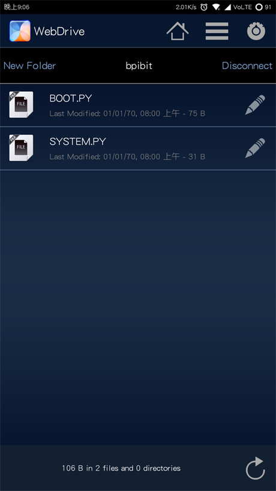

&emsp;&emsp;然后你又又可以开始编程啦。

#### Linux

&emsp;&emsp;我使用的是 Lubuntu 17 系统（基本和 Ubuntu 一致），在默认提供的 PCManFM 文件管理器中直接输入 dav://192.168.1.14/ 就可以了，dav:// 意思是使用 WebDAV HTTP 访问 IP 地址，访问结果如下图。

- &emsp;&emsp;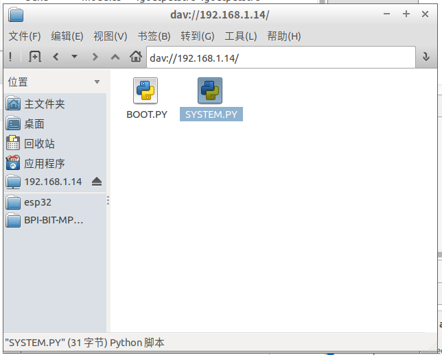

&emsp;&emsp;推荐使用 VsCode 进行编程，Vim 和 Emacs 也都不错，注意不要使用Gedit，保存时会卡死的，这种情况只能从外部拖入文件到其中覆盖保存。

#### IOS

&emsp;&emsp;这是个问题......

#### Mac

&emsp;&emsp;这也是个问题......

#### Browser

&emsp;&emsp;在这之前你需要先掌握 Windows 或 Linux 下的访问方式。
&emsp;&emsp;[浏览器在线编程](https://github.com/junhuanchen/BPI-BIT-MpyOnlineEditor)

### 4. 编写 BitBpi 中的代码工具

&emsp;&emsp;Windows随意，而Linux下不建议用gedit，推荐使用网页在线编辑的软固件。
&emsp;&emsp;但凡编写代码文件保存时卡死了，多数是文件管理工具没有缓存导致的，这时候你需要将代码文件带到外边编辑并保存，然后再移动回文件夹中覆盖文件。
&emsp;&emsp;反正我提供的在线编辑器没有这种问题XD。
